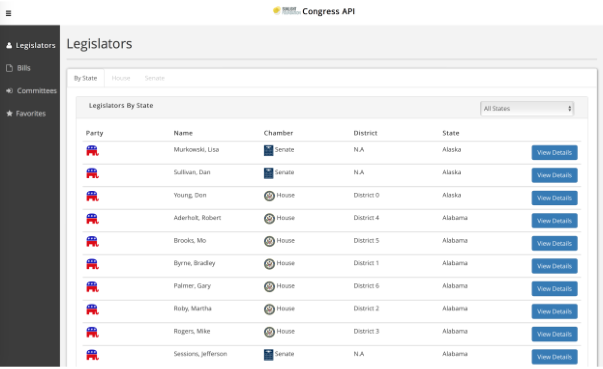

# Responsive Web Application  (Congress API)

In this Web Technologies assignment, I built on the prior [server side scripting congress  application](https://github.com/hachuele/congress-server-side-scripting), to deliver a more complete and modern web app. The objective of this assignment was to become familiar with the AJAX and JSON technologies, use a combination of HTML5, CSS, Bootstrap, jQuery, AngularJS and PHP, get hands-on experience in Amazon Web Services, and provide a responsive (Bootstrap) interface to perform congress search using Sunlight Congress APIs.

### Program Details

The application consists of a webpage that allows users to search for congress information using the Sunlight Congress API. A PHP script returns a JSON formatted data stream to the front-end. The client parses the JSON data and renders it in a nicer-looking, responsive UI (using Bootstrap). A user first opens a page as shown below:

Once the user opens this page, all of the legislators’ information data is loaded using the AJAX component in JQuery. The AJAX-JQuery code calls the PHP script. The webpage then uses JavaScript to extract data from the JSON response and displays the results on the same webpage.

The legislator details are shown as below:

The application also allows you to view bill information, with the details shown as below:

Finally, the application was built to ensure a responsive behavior (using Bootstrap), achieving results as shown below:

**NOTE:** Sunlight Congress API no longer supported as required for this application.